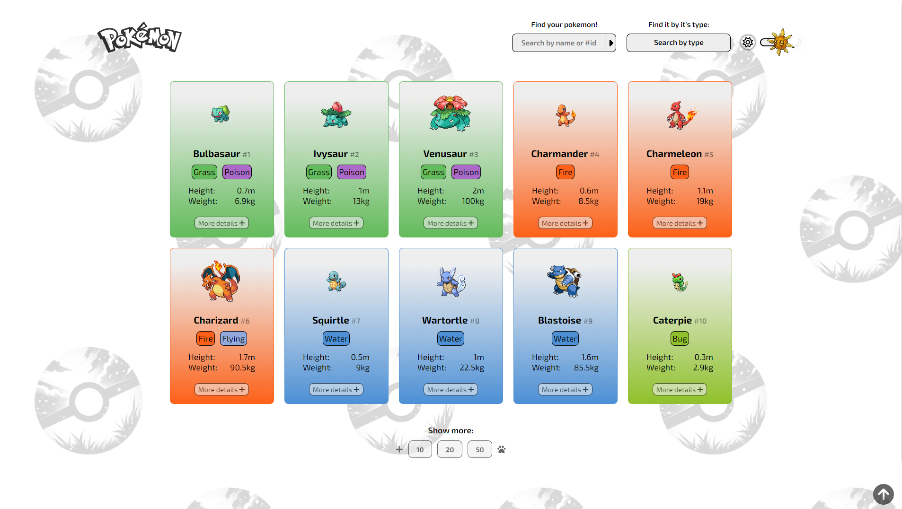
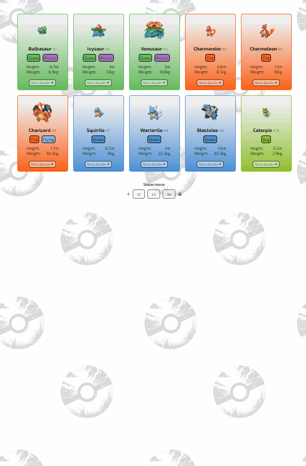
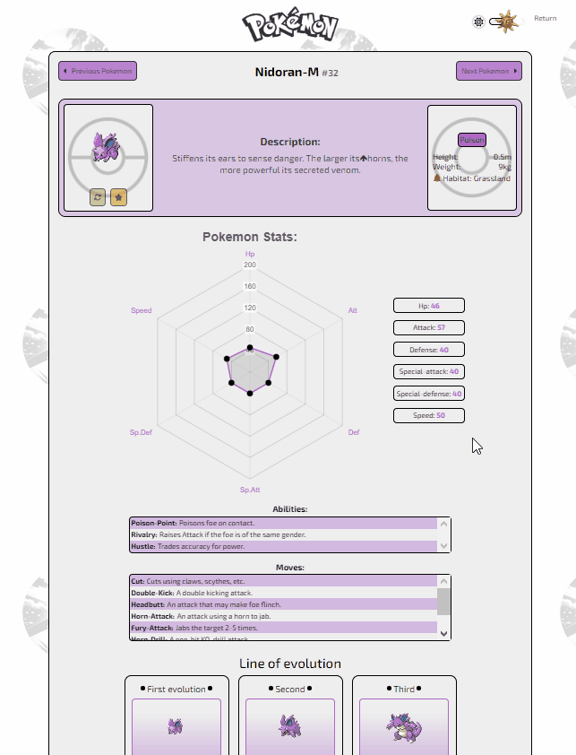
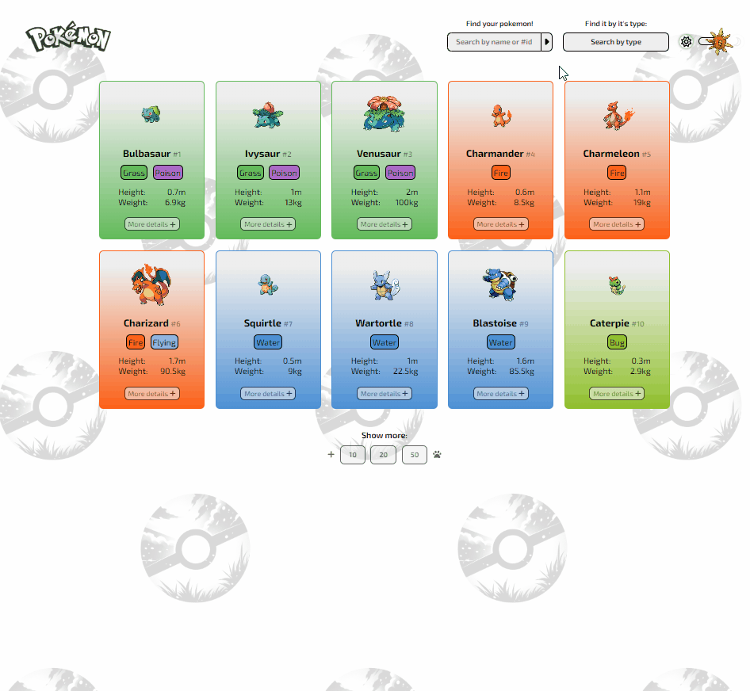
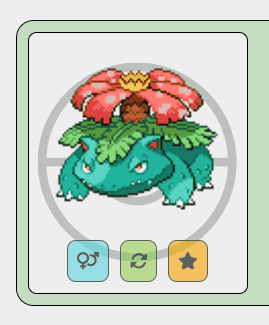
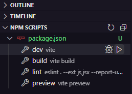

# Pokedex da PokeAPI

🧾✍ Este projeto é o exercício final do curso de Front-end do [DevQuest](https://www.linkedin.com/school/devquest-dev-em-dobro/about/).

[Clique aqui para visualizar a página do projeto no ar](https://pokedex-with-pokeapi.vercel.app).



## Sumário

- [Visão Geral](#visão-geral)
  - [O desafio](#o-desafio)
- [Meu processo](#meu-processo)
  - [Tecnologias utilizadas](#tecnologias-utilizadas)
  - [Funcionalidade do projeto](#funcionalidade-do-projeto)
  - [Como executar o projeto](#como-executar-o-projeto)
  - [Desenvolvimento contínuo](#desenvolvimento-contínuo)
  - [Agradecimentos](#agradecimentos)
  - [Recursos úteis](#recursos-úteis)
- [Autor](#autor)


## Visão-geral

### O desafio

Objetivos:

- Criar uma Home de lsitagem de pokemons utilizando a [PokeAPI](https://pokeapi.co/docs/v2);
- Criar um botão de carregamento para novos pokémons;
- Cada pokémon mostrado deve conter o nome e sua imagem. Além de que ele deve ser clicável para uma nova página contendo seus dados detalhados:
    - Imagem;
    - Nome;
    - Lista de movimentos do pokémon;
    - Lista de habilidades do pokémon;
    - Tipo do pokémon;
- A página deve conter um botão alternador de tema entre dark e light;
- A aplicação deve ser Single Page Application;
- Criado em ReactJs;
- Context API para criação do botão alternador de temas;

## Meu processo

### Tecnologias utilizadas

- [React](https://react.dev)
- [Styled-Components](https://styled-components.com)
- [Context-API](https://legacy.reactjs.org/docs/context.html)
- [LocalStorage](https://developer.mozilla.org/en-US/docs/Web/API/Window/localStorage)
- [ChartJs](https://www.chartjs.org/docs/latest/)
- [React-router-dom](https://reactrouter.com/en/main)
- [Axios](https://axios-http.com)

### Funcionalidade do projeto

Vamos dividir a explicação do projeto de acordo com os objetivos requisitados.
### 1. Coletar os dados dos pokémons
A API funciona de uma forma diferente. Quando buscamos pela lista de pokémons a API nos retorna o seu nome e uma url que possui mais dados de cada pokémon.
Dessa forma, primeiramente a lista foi solicitada e para cada url foi criado um card pokémon.

```jsx
    const getPokemons = async () => {
        const response = await fetchPokemonList(listSize, offset);
        const newPokemons = response.results;

        setDefaultList(prevPokemons => {
            const updatedPokemons = [...prevPokemons];
            newPokemons.forEach(newPokemon => {
                !updatedPokemons.some(pokemon => pokemon.url === newPokemon.url)
                    ? updatedPokemons.push(newPokemon)
                    : ''
            });
            return updatedPokemons;
        });
    }

    useEffect(() => {
        getPokemons();
    }, [offset])
```

```jsx
<div className="pokemons">
    {defaultList &&
        <>
            {defaultList.map((pokemon, index) =>
                <PokemonCard key={index} pokemonUrl={pokemon.url} />
            )}
        </>
    }
</div>
```

Transfiro a url de cada pokémon pela prop "pokemon.url" e assim coleto os dados desta url dentro deste novo componente.

### 2. Carregar mais pokémons

Foi criado um botão que recebe como prop uma função que altera os dados "offset" e "listSize" da requisição da lista de pokémons. O offset nos indica a partir de qual pokémon, através do seu id, a lista será carregada. O listsize a quantidade de pokémons que será entregue. Ou seja, offset 20 e listSize 50: a partir do pokémon de id 20 serão retornados os dados dos 30 a frente, ou seja, até o 59.

```jsx
const loadMorePokemons = async (pokemonsNumber) => {
    setOffset(defaultList.length);
    setListSize(pokemonsNumber);
    setIsLoading(true);
}
```

```jsx
<ShowMoreButtons
    showMore10={() => loadMorePokemons(10)}
    showMore20={() => loadMorePokemons(20)}
    showMore50={() => loadMorePokemons(50)}
/>
```

O resultado foi este:


### 3. Página de detalhes do pokémon.

Foi utilizado o React-router-dom, biblioteca React que trabalha com SPAs, onde foi utilizado o id de cada pokémon para criar uma url única para cada pokémon. Através do seu id eu posso também fazer uma requisição dos dados deste pokémon para criar uma página com seus dados mais detalhados.

```jsx
<Link to={`/pokemon/${pokemon?.id}`}>
    <button
        style={{
            color: theme.color,
            backgroundColor: theme.secondaryColor,
            transition: ".3s"
        }}
        className="moreDetails"
    >
        More details <FontAwesomeIcon icon={faPlus} />
    </button>
</Link>
```
Este link redireciona o usuário a uma página com os dados a seguir:

```jsx
return (
    <>
        <Container>
            <div className="backgroundImage" style={{ filter: themelogoColor }}></div>
            <NavBar />
            <div className="content" style={{ color: theme.color, backgroundColor: theme.secondaryColor }}>
                <PokemonPanel id={id} />
                <PokemonStats />
                <MovementsAndAbilities />
                <PokemonEvolution />
            </div>
        </Container>
        <Footer />
    </>
)
```
Esta nova página contém o painel do pokémon, com sua foto, alguns dados e sua descrição. Também é apresentados os dados de vida, ataque , defesa, entre outros (criado com [ChartJS](https://www.chartjs.org/docs/latest/)), seus movimentos e abilidade e sua linha de evolução, quando existir. Este é o resultado:



### 4. Theme Toggler Button (Botão alternador de temas)

Foi utilizado o [Context-API](https://legacy.reactjs.org/docs/context.html) para transmitir os dados de um objeto contendo os temas dark e light de toda página. Assim, quando o botão alternador de tema era acionado, ele alterna o tema em toda a página. Com o auxílio do [LocalStorage](https://developer.mozilla.org/en-US/docs/Web/API/Window/localStorage) o tema selecionado pelo usuário permanece, mesmo que a página seja recarregada.

```jsx
export const themes = {
    light: {
    },
    dark: {
    },
}

export const ThemeContext = createContext({});

export const ThemeProvider = (props) => {
    const themeLocal = JSON.parse(localStorage.getItem('themeKey'));
    const themeStorage = themeLocal ? themeLocal : themes.light;

    const [theme, setTheme] = useState(themeStorage);
    
    useEffect(() => {
        window.localStorage.setItem('themeKey', JSON.stringify(theme))
    }, [theme]);

    return (
        <ThemeContext.Provider value={{theme, setTheme}}>
            {props.children}
        </ThemeContext.Provider>
    )
}
```


### 5. Procurando pokémons pelo nome e pelo tipo

Foi criado duas maneiras de procurarmos os nossos pokémons preferidos através do seu tipo (elétrico, aquático, lutador, etc.) e pelo seu nome. De forma simples, ao digitar o nome do pokémon no input, o valor do input e coletado e adicionado a uma requisição à API e assim o card do pokémon é retornado. Da mesma forma que a API nos fornece uma url em que podemos coletar os dados de todos os pokémons de um mesmo tipo. Assim, foi adicionado alguns botões com ícones que representem o tipo dos pokémons. Ao clicar em um botão, solicitados à API a lista e assim, para cada pokémon é criado um card que o representa.

```jsx
{typeList.length > 0 &&
    <>
        <button
            className="return" style={{ color: theme.color }}
            onClick={() => handleReturnList()}
        >
            <FontAwesomeIcon icon={faUndoAlt} />
            <p className="returnText">Return</p>
        </button>
        {typeList.map((pokemon, index) =>
            <PokemonCard key={index} pokemonUrl={pokemon.pokemon.url} />
        )}
    </>
}
```



Algumas outras funcionalidades foram adicionadas ao projeto para melhorar a experiência do usuário, mesmo que não seja um pré-requisito do execício solicitado pelo [DevQuest](https://www.linkedin.com/school/devquest-dev-em-dobro/about/), como visualizar as versões shiny e female de alguns pokémons, além de inverter usa imagem, para visualizá-lo em 360°.



Por fim, o projeto foi criado para ser responsivo em todos os dispositivos dos usuários.


### Como executar o projeto
- O projeto foi realizado através do [React-Vite](https://vitejs.dev).

- Ao baixar o projeto, abrir o terminal do VSCode e digitar o código de instalação das dependências: **npm install**

- O arquivo package.json já possui a versão da biblioteca em seus dados, portanto todas as bibliotecas utilizadas nesse projeto serão instaladas em sua máquina da mesma forma. Mas caso tenha interesse em como baixar, utilizar ou aprender mais sobre as bibliotecas e API's que foram utilizadas no meu código, além do localStore, acesse os links [Context API](https://legacy.reactjs.org/docs/context.html), [styledComponents](https://styled-components.com/docs), [localStore](https://developer.mozilla.org/en-US/docs/Web/API/Window/localStorage).

- Para rodar o projeto no navegador é necessário ativar o **NPM Scripts** nos três pontos ao lado do EXPLORER do VSCODE


- Em seguida, na janela inferior esquerda do **NPM SCRIPTS** clicar no botão **run** do package.json/dev vite



- Por fim, no terminal irá aparecer o **local-host** que será executado no seu navegador o projeto. Passe o mouse sobre ele e clique em **Follow link** ou pressione o botão **ctrl** do seu teclado e clique em cima do **local-host** e a página abrirá no seu navegador padrão.


Há outras formas de se abrir o projeto, porém esta é a forma que eu costumo optar em usar.

### Desenvolvimento contínuo

Devo admitir que levei algumas semanas para finalizar o projeto, este me tirou da zona de conforto, pois enfrentei muitas dificuldades, precisei revisar alguns conteúdos que ainda não havia aplicado e estudar novos conceitos. Na verdade eu apliquei mais conhecimentos do que o necessário, pois eu adorei o exercício e sinto que meu conhecimento cresceu exponencialmente, graças a toda equipe [DevQuest](https://www.linkedin.com/school/devquest-dev-em-dobro/), que me conduziu ao que aprendi até hoje. Sou muito grato a todos.

### Recursos úteis

- [Styled-Components](https://styled-components.com): Styled-components te permitem escrever código CSS para estilizar seus componentes. Ele também remove o mapeamento entre componentes e estilos.

- [Context-API](https://legacy.reactjs.org/docs/context.html): O Context API fornece uma maneira de passar dados pela árvore de componentes sem precisar passar props manualmente em todos os níveis.

- [LocalStorage](https://developer.mozilla.org/en-US/docs/Web/API/Window/localStorage): A propriedade "read-only" "localStorage" permite acessar um objeto Storage para a origem do documento; os dados armazenados são salvos nas sessões do navegador.

- [ChartJs](https://www.chartjs.org/docs/latest/): Chart.js fornece um conjunto de tipos de gráficos, plug-ins e opções de personalização usados ​​com frequência. Além de um conjunto razoável de tipos de gráficos integrados, você pode usar tipos de gráficos adicionais mantidos pela comunidade.

- [React-router-dom](https://reactrouter.com/en/main): React Router permite "roteamento do lado do cliente". As páginas carregam mais rápido, aprimorando a experiência do usuário final.

- [Axios](https://axios-http.com): Axios é um cliente HTTP simples baseado em promessa para o navegador e node.js. Axios fornece uma biblioteca simples de usar em um pacote pequeno com uma interface muito extensível.

## Autor

- GitHub - [Felipe Santiago Morais](https://github.com/SantiagoMorais)
- Linkedin - [Felipe Santiago](https://www.linkedin.com/in/felipe-santiago-873025288/)
- Instagram - [@felipe.santiago.morais](https://www.instagram.com/felipe.santiago.morais)
- Email - <a src="mailto:contatofelipesantiago@gmail.com">contatofelipesantiago@gmail.com</a>
